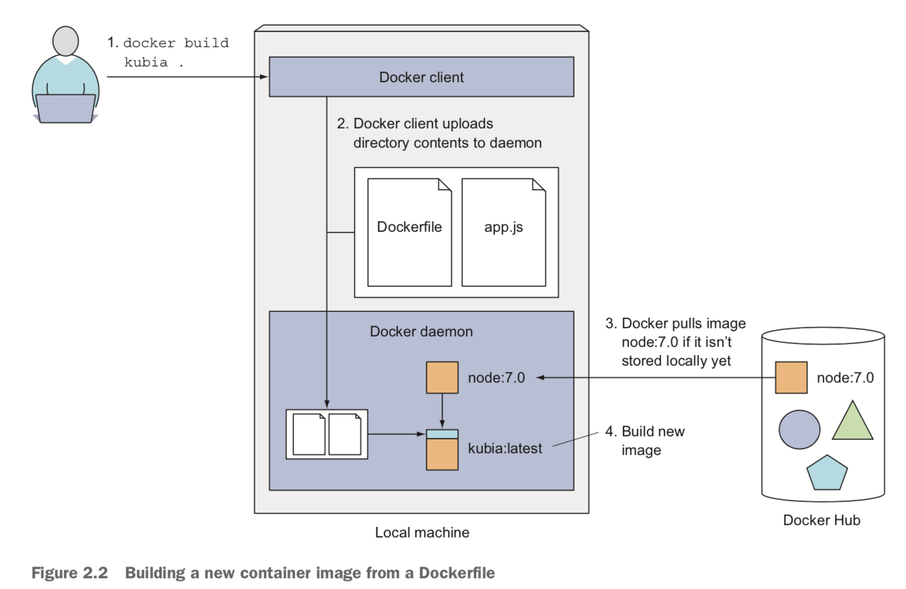
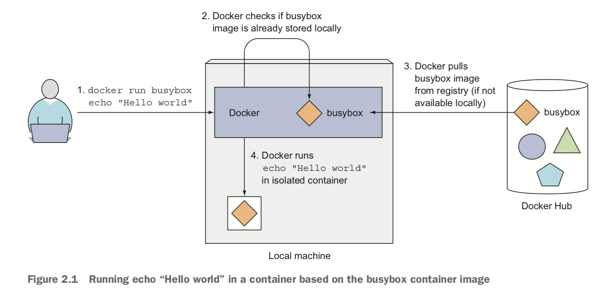

# 使用 Docker 搭建自己的编程环境

## 1. Docker 简介

### 1.1. 什么是 Docker

Docker 是什么？[如何通俗解释Docker是什么？ - 刘允鹏的回答 - 知乎](https://www.zhihu.com/question/28300645/answer/67707287) 这个回答通俗易懂地从环境依赖、系统依赖、与虚拟机的区别等方面介绍了 Docker 的作用。

此外，在云时代的今天，Docker 与 K8S 更是无缝结合，为我们开发、测试、部署、交付、维护应用提供了便捷的手段。

不过 K8S 就是另外一个话题了，我们先从 Docker 入手来窥探 Docker 的使用方法以及基本原理。读了本文，你讲了解到：

1. Docker client 与 daemon 分别是什么，如何工作
2. Docker 常用命令以及一些注意事项
3. 为什么要为非 root 身份用户构建环境，以及如何用该身份运行 Docker
4. 一些好用的编程工具及配置方法
5. 如何在容器中访问及编辑（读写）你宿主机中的代码

*至于如何安装 Docker，则可以参考官方文档：http://docs.docker.com/engine/installation/*

### 1.2. Docker 如何工作？

Docker 会在 Linux 虚拟机（VM）中运行。如果你使用的是 Mac 或者 Windows，Docker 会为你创建一个 VM 并且在其中运行 Docker 守护进程（Docker Daemon），相当于一个服务端程序，而 Docker 会开另外一个客户端进程供用户交互。

首先，如果从我们编写的 Dockerfile 来编译镜像的话，则执行 `docker build`。编译过程并不是直接在 client 端运行的。当用户执行 `docker build` 时，client 会把所有依赖文件上传给 daemon。daemon 与 client 可以不在同一台机器上面，这意味着上传过程可能需要依赖网络传输，因此**尽量不要依赖不必要文件，这会直接影响编译速度**。

在编译时，Docker 会把基础镜像（Base Image）从镜像仓库拉取到本地。**镜像并不是单一的一个二进制文件，而是由多个层组成。**多个镜像可能共享同一个层，这一特点使得镜像存储、传输都非常轻量级。例如你使用同一个基础镜像创建多个镜像，那么基础镜像只会存储一次。每次从镜像仓库如 Docker Hub 拉取的时候，只会拉取本地没有的层。



其次是 `docker run` 命令，该命令用来运行某一镜像（image）。当用户执行 `docker run` 命令时，docker 首先会检查镜像是否已经在本地，如果不在本地的话，则从 Docker Hub 拉取镜像到本地，然后开启容器进程运行。



### 1.3. Dockerfile 基本命令及示例

#### RUN

每个 `RUN` 命令会在当前镜像的最新的一层执行命令并提交结果，Dockerfile 的下一步执行则会基于上一步提交的镜像进行。

`RUN` 命令有两种格式：

1. `RUN <command>` ，或者称为 `shell` 格式：默认使用 `/bin/sh` 来执行
2. `RUN ["executable", "param1", "param2"]` ，或者称为 `exec` 格式

注意的是，`RUN` 命令默认使用的 shell 是 `/bin/sh` ，这意味着某些 `/bin/sh`  不支持的命令则执行会报错，例如 `source `。`source` 命令默认的 `/bin/sh` 是不支持的，因此必须切换为 `/bin/bash` 或其他支持的 shell，如：`RUN /bin/bash -c 'source $HOME/.bashrc; echo $HOME'`。

另外， `exec` 格式是使用 JSON 来解析的，因此命令参数要使用双引号 `RUN ["x", "xx", "xxx"]`；并且，`exec` 格式不会直接调用 shell，因此一些 shell 处理是不会执行的，例如参数替换，命令 `RUN [ "echo", "$HOME" ]` 是不会对 `$HOME` 进行替换的。若需要 shell 处理，则需要显式调用 shell，例如 `RUN [ "sh", "-c", "echo $HOME" ]`，因为指定了 shell 之后，是该 shell 来进行命令解析，而不是 Docker。

#### ENV

每一行 `ENV` 都会创建一个中间层，就像 `RUN` 一样，这意味着即使你在未来步骤 `unset` 了该变量，这个变量依然会保留在前面那层，并且最终可以读到。你可以使用下面 Dockerfile 对其进行验证：

```
FROM alpine
ENV ADMIN_USER="mark"
RUN echo $ADMIN_USER > ./mark
RUN unset ADMIN_USER
```

为了避免这样的情况，我们可以在同一层新建、使用、销毁一个环境变量：

```
FROM alpine
RUN export ADMIN_USER="mark" \
    && echo $ADMIN_USER > ./mark \
    && unset ADMIN_USER
CMD sh
```

#### ADD

`ADD` 用来拷贝文件、目录、甚至 URLs，并添加到镜像的文件系统中。该命令也有两种形式：

1. `ADD [--chown=<user>:<group>] <src>... <dest>`
2. `ADD [--chown=<user>:<group>] ["<src>",... "<dest>"]` ，这种格式通常用来拷贝文件名带空格的文件。

## 2. 使用非 root 身份运行 Docker

为什么需要使用非 root 身份运行 Docker？其实就本文章的目标而言，此举是非必要的，即，完全可以在 root 身份下直接进行，并把环境依赖安装在 root 环境中，这当然是没有问题的。但是，如果在未来某些场景中，如果用户直接以 root 身份访问生产环境的 Docker，那么有时候后果是难以设想的。

并且，在许多场景中，我们需要为用户提供统一的访问者身份，并部署相应的环境依赖，满足访问者的部分需求。因此，我们有必要学习一下，如何为某一用户部署环境，并使用该用户的身份运行 Docker。

此小节我们会简明介绍如何以非 root 身份运行 Docker。

默认的话，Docker 会用 root 身份运行，用户 ID 为 0，这个可以使用 `id -u <username>` 来查看。

我们可以使用 `--user username:usergroup` 参数来指定用户身份运行。但是，如果直接使用用户名、组名的话，容器是找不到该用户名的，因为没有对应的 ID。因此，我们需要指定用户 ID 及组 ID。

```
# 添加组 yaoleiqi，并指定 ID
RUN groupadd -f -g 200 yaoleiqi

# 添加用户 yaoleiqi 并指定 home 目录，指定用户 ID、所属的组
RUN useradd -m -d /home/yaoleiqi -u 200 yaoleiqi -g yaoleiqi

# 将 yaoleiqi 添加到 sudo 组
RUN usermod -aG sudo yaoleiqi

# 更改用户 yaoleiqi 的密码
RUN echo "yaoleiqi:yao12345" | chpasswd
```

完整语句如下：

`docker run -it --user 200:200 awesome_dev:latest`

## 3. 编写我们的环境

#### 3.1. 构建 base 镜像

base 镜像可以是我们其他镜像的基础，构建一些常用并且通用的环境。

在本示例中，其实只做了两件事：

1. 安装环境依赖
2. 创建用户、组并进行一些 home 目录、密码、权限的配置

```
FROM ubuntu:18.04
MAINTAINER yaoleiqi "yaoleiqi@qq.com"

# build requirements
RUN apt-get update && apt-get install -y \
    ninja-build \
    gettext \
    libtool \
    libtool-bin \
    autoconf \
    automake \
    cmake \
    g++ \
    pkg-config \
    unzip \
    git \
    sudo \
    build-essential \
    checkinstall \
    wget \
    vim \
  && rm -rf /var/lib/apt/lists/*

# make the "en_US.UTF-8" locale so myenv will be utf-8 enabled by default
RUN apt-get update && apt-get install -y locales \
  && rm -rf /var/lib/apt/lists/* \
  && localedef -i en_US -c -f UTF-8 -A /usr/share/locale/locale.alias en_US.UTF-8
ENV LANG en_US.utf8

# build python3
# This hack is widely applied to avoid python printing issues in docker containers.
# See: https://github.com/Docker-Hub-frolvlad/docker-alpine-python3/pull/13
ENV PYTHONUNBUFFERED=1

RUN apt-get update && apt-get install -y \
    python3-pip \
    python-dev \
    python3-dev \
  && rm -rf /var/lib/apt/lists/* \
  && cd /usr/local/bin \
  && sudo ln -s /usr/bin/python3 python \
  && sudo pip3 install --upgrade pip

# I like python, so I install the latest version of python
RUN apt-get update && apt-get install -y \
    software-properties-common -y \
  && add-apt-repository ppa:deadsnakes/ppa -y \
  && apt-get update && apt-get install -y \
    python3.8 \
    python3.8-dev \
  && rm -rf /var/lib/apt/lists/*

# install other dev tools
RUN apt-get update && apt-get install -y \
    tmux \
    zsh \
    neovim \
    curl \
    silversearcher-ag \
    python3-neovim \
  && rm -rf /var/lib/apt/lists/*

# add group
RUN groupadd -f -g 200 yaoleiqi

# add user
RUN useradd -m -d /home/yaoleiqi -u 200 yaoleiqi -g yaoleiqi
RUN usermod -aG sudo yaoleiqi
RUN echo "yaoleiqi:yao12345" | chpasswd
```

#### 3.2. 构建 dev 环境

dev 环境则进行一些定制化的配置，在本示例中，将构建特定用户的定制化环境依赖，即为用户 yaoleiqi 构建 vim 环境、virtualenv 环境等。

```
FROM yaoleiqi/devbase:latest
MAINTAINER yaoleiqi "yaoleiqi@qq.com"

ENV HOME /home/yaoleiqi

# build virtual enviroment
RUN python3.8 -m pip install virtualenv \
  && virtualenv -p `which python3.8` $HOME/myenv

# install oh-my-zsh
COPY install_zsh.sh /tmp/
RUN chmod +x /tmp/install_zsh.sh \
  && sh /tmp/install_zsh.sh

# install tmux
RUN cd $HOME \
  && git clone https://github.com/gpakosz/.tmux.git \
  && ln -s -f .tmux/.tmux.conf \
  && cp .tmux/.tmux.conf.local .

# install golang
RUN wget https://dl.google.com/go/go1.14.4.linux-amd64.tar.gz -O /tmp/go.tar.gz \
  && tar -C /usr/local -xzf /tmp/go.tar.gz \
  && mkdir $HOME/go \
  && echo "export PATH=$PATH:/usr/local/go/bin\n\
export GOROOT=/usr/local/go\n\
export GOPATH=$HOME/go\n" >> $HOME/.profile

# install vim plugins
COPY vimrc.sh $HOME/.vimrc

# git config
COPY gitconfig $HOME/.gitconfig

# build vim plugins
# install vundle
RUN mkdir -p $HOME/.config/nvim/bundle \
  && git clone https://github.com/VundleVim/Vundle.vim.git $HOME/.config/nvim/bundle/Vundle.vim \
  && mkdir -p $HOME/.vim/bundle \
  && git clone https://github.com/ycm-core/YouCompleteMe.git $HOME/.vim/bundle/YouCompleteMe \
  && cd $HOME/.vim/bundle/YouCompleteMe \
  && git submodule update --init --recursive \
  && git clone https://github.com/morhetz/gruvbox.git $HOME/.vim/bundle/gruvbox

RUN /bin/bash -c 'source $HOME/.profile; \
  $HOME/myenv/bin/python $HOME/.vim/bundle/YouCompleteMe/install.py --go-completer'

RUN runuser -l yaoleiqi -c 'vim +PluginInstall +qall > /dev/null' \
  && runuser -l yaoleiqi -c 'vim +GoInstallBinaries +qall > /dev/null'

RUN chown -R yaoleiqi:yaoleiqi $HOME
```

## 4. 运行我们的环境

运行环境的前提是，已经安装好 Docker。那么运行以下几个命令即可进入我们的开发环境：

```
git clone https://github.com/Sar-Kerson/myenv.git
docker build -t --no-cache yaoleiqi/devbase:latest . && docker build  -t --no-cache awesome_dev:latest ./awesome_dev/
docker run -it --user 200:200 awesome_dev:latest
```

然后，就可以放飞自我的开始码代码了！等等！在此之前我们先手动安装一下 vim 环境，由于 vimrc 已经配置好，只需要执行以下两步即可（中间会遇到）：

```
# 安装插件
runuser -l yaoleiqi -c 'vim +PluginInstall +qall > /dev/null'
# optinal：安装 vim-go，如果你需要写 golang 代码，那么推荐使用
runuser -l yaoleiqi -c 'vim +GoInstallBinaries +qall > /dev/null
```

## 5. 使用 Volume 持久化容器中的文件

根据官方文档介绍，`volumes` 是推荐的持久化手段，并且由 Docker 进行管理。这意味着数据在 mount 的同时，Docker 可以做一些其他工作，例如文件系统兼容（Linux 与 Windows 互通）、多个容器共享、文件加密等等，具体可以参考 https://docs.docker.com/storage/volumes/。

并且，`volumes` 独立于容器的生命周期，是插拔式的存在，不会增加容器的大小。但是，如果你不需要持久化数据的话，最好还是使用 tmpfs 方式，因为 tmpfs 是直接内存操作，速度会比写入硬盘快得多。因此，我们也可以在容器里直接 `git clone` 和 `git push` 来编辑我们的代码。


但是，对于一些数据文件，例如运行结果或者配置文件，我们通常还是可以利用 `volumes` 来持久化、或者多个容器共享的。具体使用方式是，在 `docker run` 时使用 `-v` 标志，`docker run -v /host/directory:/container/directory -other -options image_name command_to_run`，这样则会将宿主机的 `/host/directory` 映射到容器中的 `/container/directory`，在容器中对该目录的任何修改，都会同步映射到宿主机上。

另外，我们也可以直接创建 `volumes` ，在任何时候挂载到任何容器上。例如，创建一个名为 `my-vol` 的 `volume`：

```
docker volume create my-vol
```

然后列出所有 `volume`：

```
$ docker volume ls
local               my-vol
```

查看一个 `volume` 的具体信息：

```
$ docker volume inspect my-vol
[
    {
        "Driver": "local",
        "Labels": {},
        "Mountpoint": "/var/lib/docker/volumes/my-vol/_data",
        "Name": "my-vol",
        "Options": {},
        "Scope": "local"
    }
]
```

我们还可以运行一个挂载 `volume` 的容器。下面命令将 宿主机的 `my-vol` 挂载到容器的 `/app`。

```
$ docker run -d \
  --name devtest \
  --mount source=my-vol,target=/app \
  nginx:latest
```

## 6. References

- https://medium.com/better-programming/running-a-container-with-a-non-root-user-e35830d1f42a

- https://medium.com/redbubble/running-a-docker-container-as-a-non-root-user-7d2e00f8ee15

- https://www.cyberciti.biz/open-source/command-line-hacks/linux-run-command-as-different-user/

- https://docs.docker.com/storage/volumes/
